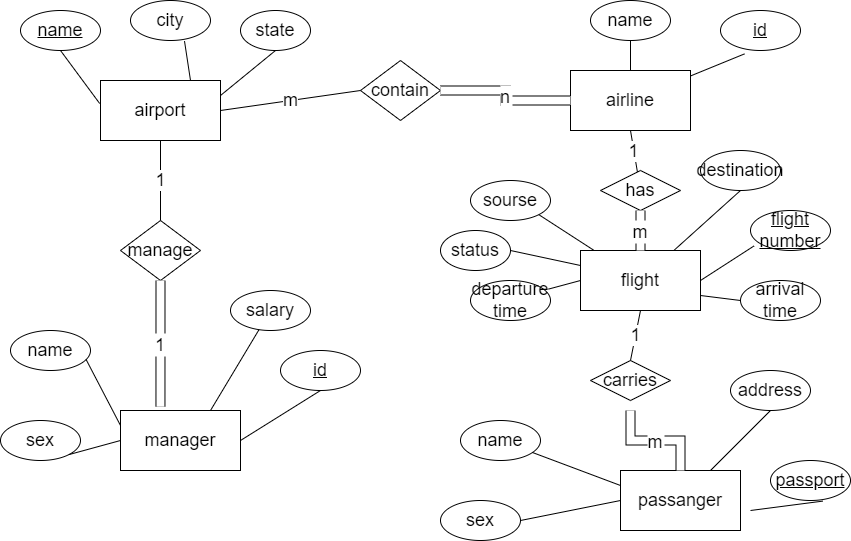

 Advanced Flight Management System

**A sophisticated Java-based airline management platform** demonstrating strong OOP principles, MySQL database integration, and console UI design.

##  Key Technical Achievements

 **Full CRUD Operations** - Comprehensive Create, Read, Update, Delete functionality across 6 database tables  
 **Complex Relationships** - Managed airport-airline-flight-passenger relationships through proper database normalization  
 **Transaction Safety** - Implemented proper error handling for database operations  
 **Clean Architecture** - Separation of concerns with well-structured Java code  
 **User Experience** - Intuitive console interface with menu-driven navigation  

##  Technical Stack Deep Dive

| Component       | Technology Used | Why It Matters |
|----------------|----------------|----------------|
| **Core Logic** | Java 17 | Demonstrated OOP mastery with proper encapsulation |
| **Database** | MySQL 8.0 | ACID-compliant data management |
| **Connectivity** | JDBC API | Professional-grade database integration |
| **Version Control** | Git/GitHub | Industry-standard collaboration tools |

##  How This Project Stands Out

 **Real-World Modeling**: Accurately represents actual airline operations  
 **Scalable Design**: Architecture allows for easy feature additions  
 **Data Integrity**: Foreign key constraints ensure relational accuracy  
 **Professional Standards**: Includes proper documentation and Git practices  

## Database Schema UML Diagram

*Figure 1: UML Class Diagram of the Database Schema*
